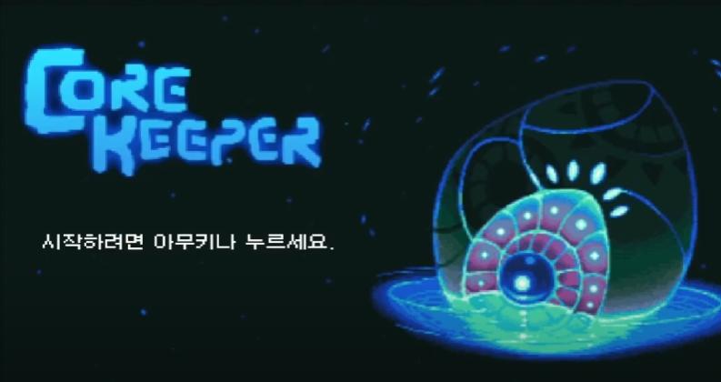
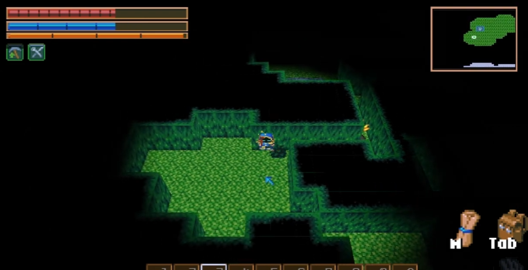
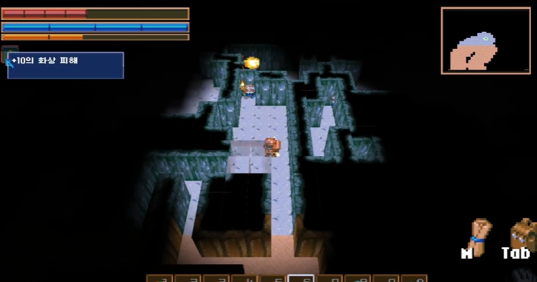
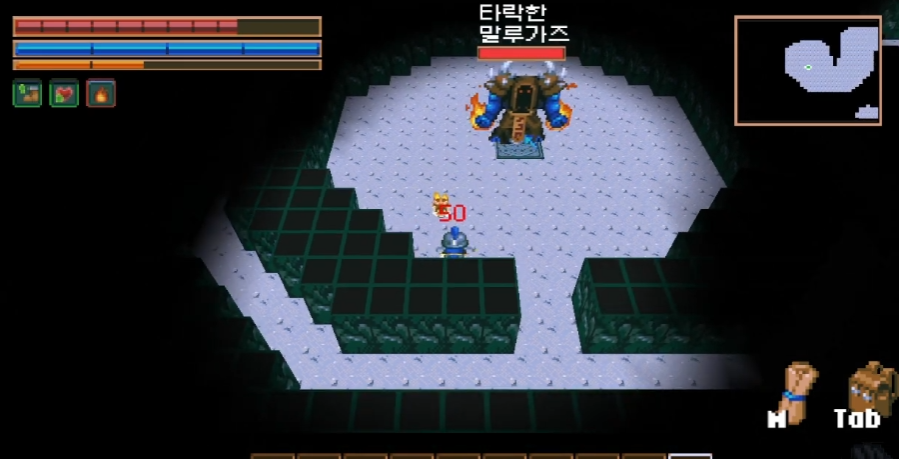
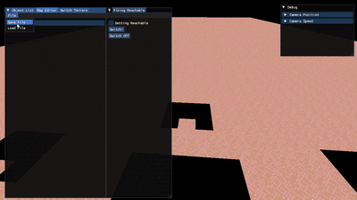
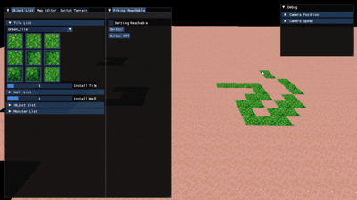
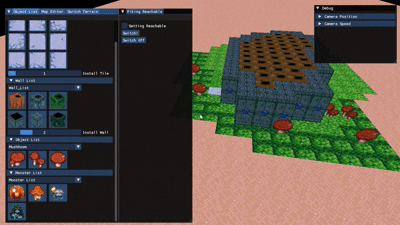
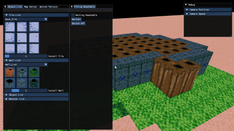

<!-- 기술 배지 -->

# CoreKeeper 팀 프로젝트 (DirectX9 기반 3D 샌드박스 게임)

## ■ 개요
- CoreKeeper는 **DirectX9 그래픽 API를 학습하기 위한 2.5D 샌드박스형 팀 프로젝트**입니다.  
- 총 4명이 참여하였으며,  
  저는 **맵툴 제작 및 월드 맵 디자인, 오브젝트 연동 및 미니맵 시스템**을 담당했습니다.
- **DirectX9 / ImGui / WinAPI / 자체 렌더링 파이프라인** 기반으로 제작했습니다.  
- 첫 DirectX 프로젝트로, **그래픽 API 구조 및 렌더링 파이프라인의 전반적인 흐름을 익히는 것**에 중점을 두었습니다.

---

## ■ 개발 환경
- 언어: C++
- 개발 도구: Visual Studio 2022, Windows API, ImGui Library, Git, SourceTree
- 그래픽 API: DirectX9
- 개발 인원: 4명
- 개발 기간: 2024.09 ~ 2024.11

---

## ■ 시연 영상
- [CoreKeeper 시연 영상 재생](https://youtu.be/p2AZdOhzHo4)
 
  
---

## ■ 진행 이유
- DirectX를 처음 다루며 그래픽 파이프라인의 구조와 흐름을 익히기 위해 시작했습니다.  
- 직접 구현한 툴 기능을 팀원이 사용해보고 피드백을 받는 경험을 원했습니다.  
- **맵툴 및 게임 월드 맵 디자인을 맡아** 팀 전체 개발 흐름에 기여하고자 했습니다.

---

## ■ 구현 내용
- **외부 ImGui 라이브러리 연동**을 통해 편리한 개발 환경 구축  
- **맵툴 제작 및 편집 툴 기능 구현**  
- 게임 월드 및 맵 디자인 제작  
- 오브젝트 및 맵 디자인 파일 → 데이터 파일로 변환 및 배포  
- **뷰포트 기반 미니맵 구현**  
- 오브젝트와 미니맵 간 실시간 연동 작업  
- 기타 오브젝트 상호작용 처리

| 맵 데이터 로딩 테스트 | 타일 설치 기능 |
| :---: | :---: |
|  |  |
| **몬스터 배치 기능** | **벽면 제거 기능** |
|  |  |
---

## ■ 성과
- **3D 공간 내 행렬, 좌표 변환 과정의 원리 및 DirectX 좌표계 처리**를 체득했습니다.  
- 렌더링 파이프라인의 상태 전환과 순서 제어 과정을 이해했습니다.  
- **Git / SourceTree를 활용한 협업 및 버전 관리 경험**을 쌓았습니다.  
- 팀 내 피드백 기반의 맵 디자인 및 툴 사용 개선 과정을 진행했습니다.

---

## ■ 담당 파트 핵심 요약
- ImGui 기반 맵툴 시스템 제작  
- 맵 파일 데이터 변환 및 로드 시스템  
- 미니맵 렌더링 및 오브젝트 연동  
- DirectX9 렌더링 파이프라인 학습 및 좌표계 변환 처리  
- 협업용 Git/SourceTree 환경 구성 및 관리
